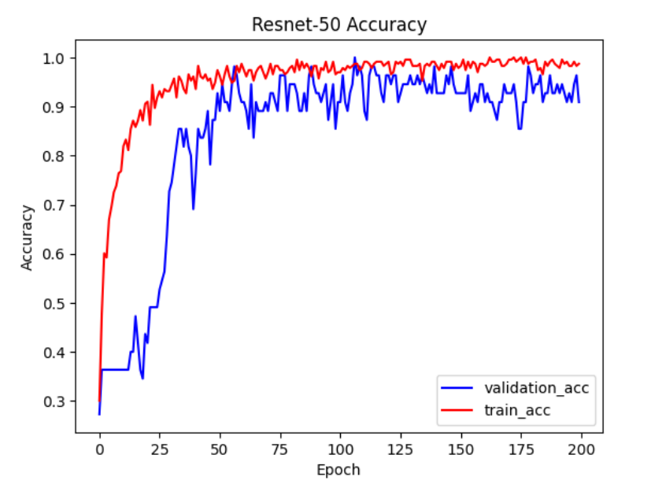
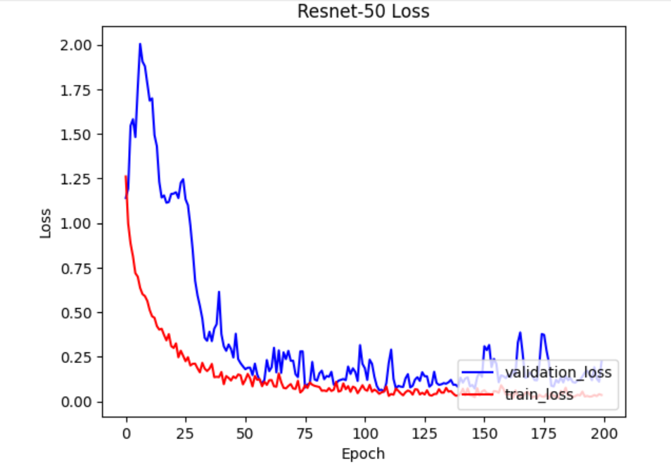
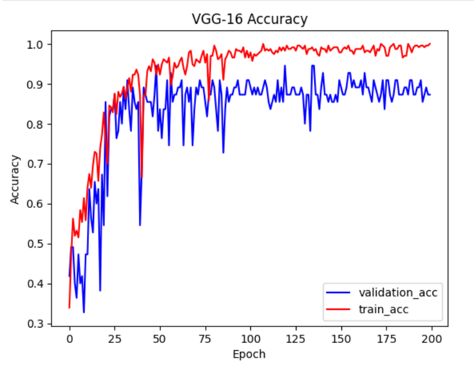
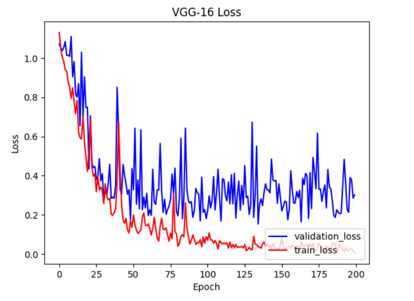

[![LinkedIn][linkedin-shield]][linkedin-url]

<!-- PROJECT NAME -->
 

  <h3 align="center">Control Mountain-Car-v0 Gym Using Webcam</h3>

<!-- TABLE OF CONTENTS -->

  
Table of Contents

  <ol>
    <li>
      <a href="#about-the-project">About The Project</a>
      <ul>
        <li><a href="#built-with">Built With</a></li>
      </ul>
    </li>
    <li><a href="#preparing-dataset">Preparing Dataset</a></li>
    <li><a href="#model-for-training">Model for Training</a></li>
    <li><a href="#evaluation">Evaluation</a></li>
    <li><a href="#results">Results</a></li>
  </ol>

<!-- ABOUT THE PROJECT -->
## About The Project
Controlling mountain car environment provided by openAI gym, using hand gestures by training dataset on pretrained VGG16 model on imagenet. 

(<a href="#readme-top">back to top</a>)

### Built With

This section should list major frameworks/libraries used to bootstrap this project.

* [![Tensorflow][Tensorflow.js]][Tensorflow-url]
* [![OpenCV][OpenCV.js]][OpenCV-url]
* [![Gym][Gym.js]][Gym-url]

(<a href="#readme-top">back to top</a>)

<!-- PREPARING DATASET -->
## Preparing Dataset
As there are three actions for input for mountain car environment, in this project the dataset is divided into three classes i.e. 0, 1, 2. Class 0 contains data for action 0 and similarly for class 1 and 2. 

This project uses hand gestures to publish actions to the mountain car environment. Class 0 contains images of a human raising his index fingure just. When just the index finger is raised the action 0 is to be published, whereas class 2 contains images of person raising his index and middle finger both. Class 1 contains images of a person doing nothing, just sitting.  So to sum up there are two gestures one raising index finger for action 0 and the other is to raise two fingers for action 2. These gestures are simple and accesible, as in action 1 the car does not move so for this action the person has to do nothing.

The webcam is used to take photos  for creating dataset. 3 different person's photos are taken at differnt situaions, differnt lighting and with different camera angle. The photos of first 2 persons are used for training and validation whereas the third person's data is used for testing.

The data is divided into training, validation and testing. Training contains 70% of the data where as validation contains 20% and testing contains the remaining 10%.  

(<a href="#readme-top">back to top</a>)

<!-- MODEL FOR TRAINING -->
## Model for Training

In this project pretrained VGG-16 and ResNet50 on imagenet are used for training. Basic models are used in this project, with changes made only to the final layer. This is because this is just a three class classification problem while these models are built to handle up to 1000 classes.The last layer of both the models are passed through:
- Global average pooling layer 
- Flatten layer to flatten the output to 1 dimension 
- A final Fully Connected Softmax Layer
- Stochastic gradient descent is used as an optimizer 

(<a href="#readme-top">back to top</a>)

<!-- EVALUATION -->
## Evaluation

For evaluation of models following metrics were observed:
+ Accuracy
+ Loss
+ Precision
+ Recall

For the task both Resnet50 and VGG16 were used and compared on the basis of time in which each frame is passed through the model and prediction is made by the model. 
The task is tested on four persons whereas the dataset was collected from only 3 of them.

(<a href="#readme-top">back to top</a>)

<!-- RESULTS -->
## Results

Initially the trained models evaluation metrics for validation fluctuated and also the loss was increasing which indicates signs of overfitting. Following are some results of initial trainings:

   

(<a href="#readme-top">back to top</a>)

<!-- MARKDOWN LINKS & IMAGES -->
[linkedin-shield]: https://img.shields.io/badge/-LinkedIn-black.svg?style=for-the-badge&logo=linkedin&colorB=555
[linkedin-url]: https://www.linkedin.com/in/waleed-siddiqui-ml-robotics/
[Tensorflow.js]: https://img.shields.io/badge/Tensorflow-Machine%20learning%20framework-yellow
[Tensorflow-url]: https://www.tensorflow.org/
[OpenCV.js]: https://img.shields.io/badge/OpenCV-Image%20processing-green
[OpenCV-url]: https://opencv.org/
[Gym.js]: https://img.shields.io/badge/Gym-Reinforcement%20Learning-lightgrey
[Gym-url]: https://www.gymlibrary.dev/
